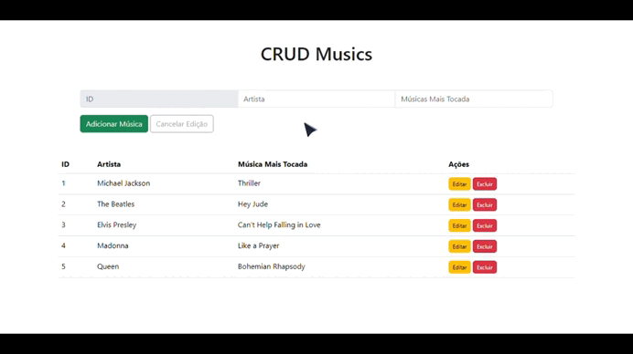

# CRUD Básico de Artistas e Músicas

Teaser:



## Sobre

Projeto desenvolvido afim de compreender o uso de requisições e observables no framework Angular (versão 17).

## Tecnologias Utilizadas

- Angular 17
- Typescript
- NodeJS
- Bootstrap
- Json-server

## Instalação

**Instalar Angular CLI:**

```shell
$ npm install -g @angular/cli
```
**Instalar dependências:**
```shell
$ npm install
```
**Simular API Rest:**
```shell
$ npm install -g json-server
```
**Acesse a pasta src/db e execute o seguinte comando para criar o endpoint:**
```shell
$ json-server --watch db.json
```

**Execução do projeto:**
```shell
$ ng serve -o
```
## Observações

- Pode-se alterar o arquivo db.json para quais dados desejar, desde que mantenha a estrutura do objeto.
- Serão necessários dois terminais, o primeiro executa a simulação de API e o segundo a interface do usuário.
- É possível executar API e UI em paralelo no mesmo terminal, com o uso da ferramenta Concurrently. [Clique para saber mais.](https://www.npmjs.com/package/concurrently)

Desenvolvido por Márkys Corrêa.